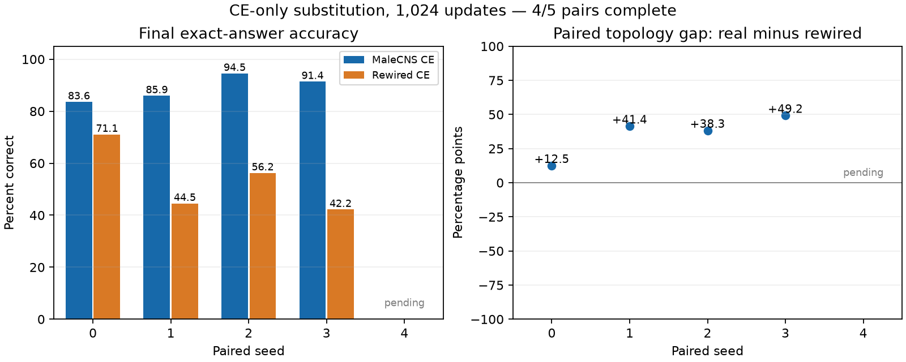
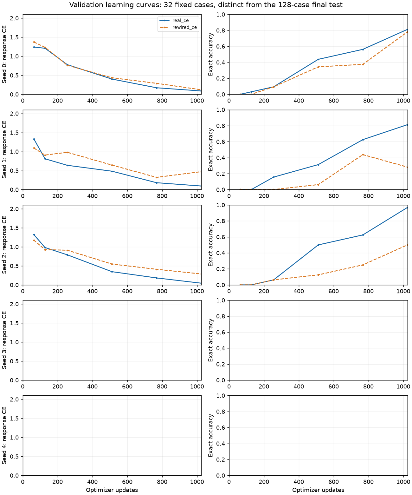

# Paired CE topology replication — full report

Updated 2026-09-13T17:52:39.691882+00:00.

**Status: INTERIM — 2/5 matched final comparisons complete.** The separate compiler-method tournament is not declared complete by this report.

## Main result

Across 2 completed pairs, MaleCNS averages **84.77%** exact accuracy and degree-preserving rewiring averages **57.81%**. The mean paired gap is **+26.95 percentage points**, with 2/2 positive gaps.

These are computational results on a fixed-length deterministic task. They do not establish arbitrary computation, length generalization, natural-language competence or implementation in living tissue. The test was previously inspected, and seed zero motivated this replication; inference is exploratory.

| Seed | MaleCNS correct / 128 | Rewired correct / 128 | MaleCNS exact | Rewired exact | Gap (pp) |
|---|---:|---:|---:|---:|---:|
| 0 | 107 | 91 | 83.59% | 71.09% | +12.50 |
| 1 | 110 | 57 | 85.94% | 44.53% | +41.41 |
| 2 | pending | pending | pending | pending | pending |
| 3 | pending | pending | pending | pending | pending |
| 4 | pending | pending | pending | pending | pending |

## Uncertainty and variance

The primary replication unit is the paired seed. The same 128 test instances appear in every pair; they must not be treated as 640 independent replications. Seed zero reuses the historical MaleCNS checkpoint. Fresh seeds 1–4 are also summarized separately.

| Group | n | Mean gap (pp) | Gap SD (pp) | MaleCNS SD (pp) | Rewired SD (pp) | Rewired / MaleCNS variance ratio |
|---|---:|---:|---:|---:|---:|---:|
| all_seeds | 2 | +26.95 | 20.44 | 1.66 | 18.78 | 128.44 |
| fresh_seeds | 1 | +41.41 | n/a | n/a | n/a | undefined |

Seed-level confidence intervals are reported after all planned pairs finish. They assume approximately independent, normally distributed paired seed differences; n=5 (or four fresh seeds) is small. Variance ratios are descriptive; no variance significance test is used. Conditional paired-example bootstrap intervals below assess sensitivity to test instances for a fixed checkpoint pair, not reliability across training seeds.

| Seed | Real-only correct | Rewired-only correct | Both correct | Both wrong | Paired-example bootstrap gap interval (pp) |
|---|---:|---:|---:|---:|---|
| 0 | 27 | 11 | 80 | 10 | [+3.12, +21.88] |
| 1 | 60 | 7 | 50 | 11 | [+31.25, +51.56] |

## Causal ablation and distributional metrics

| Seed | Condition | Response CE | Teacher KL | Exact teacher agreement | Zero-edge exact | Zero-edge CE |
|---|---|---:|---:|---:|---:|---:|
| 0 | real_ce | 0.05918 | 0.05918 | 83.59% | 0.00% | 1.92512 |
| 0 | rewired_ce | 0.14453 | 0.14452 | 71.09% | 0.00% | 1.76948 |
| 1 | real_ce | 0.06567 | 0.06566 | 85.94% | 0.00% | 1.87873 |
| 1 | rewired_ce | 0.32074 | 0.32073 | 44.53% | 0.00% | 1.74664 |

CE and KL are nats per response symbol, including the end marker. Exact answers are greedy autoregressive generations from prompts with no reference answer prefix. CE/KL use teacher forcing for probability evaluation only. Zero-edge tests remove all recurrent weights from the trained checkpoint, reset state and regenerate; input/output populations remain disjoint. This tests the necessity of recurrence for the measured capability, not biological uniqueness.

## Learning dynamics

Both conditions use the same 32 validation instances at the same checkpoints. Normalized trapezoidal area summarizes updates 64–1,024; lower CE area and higher accuracy area are better. It is not extrapolated to update zero or beyond the training budget.

| Seed | Real CE area | Rewired CE area | Real accuracy area | Rewired accuracy area |
|---|---:|---:|---:|---:|
| 0 | 0.4825 | 0.5305 | 39.69% | 31.46% |
| 1 | 0.4425 | 0.6433 | 38.96% | 17.08% |

Greater accuracy consistency at a fixed budget would be compatible with more reliable optimization. It cannot prove a better optimization landscape or distinguish optimization speed from ultimate representational capacity; no asymptotic performance is measured.

## Structural diagnostics and exploratory correlations

| Graph | Giant SCC fraction | Reciprocal fraction | Binary Perron estimate | Eigenvector residual | Mean minimum I/O hops | Reachable outputs |
|---|---:|---:|---:|---:|---:|---:|
| real | 0.991686 | 0.298932 | 399.0750 | 9.64e-10 | 1.5661 | 0.996098 |
| rewired_0 | 0.991758 | 0.005174 | 362.5353 | 1.07e-16 | 1.5406 | 0.996098 |
| rewired_1 | 0.991758 | 0.005180 | 362.1901 | 1.02e-16 | 1.5465 | 0.996098 |
| rewired_2 | 0.991764 | 0.005168 | 362.2894 | 1.75e-16 | 1.5142 | 0.996098 |
| rewired_3 | 0.991752 | 0.005166 | 362.1041 | 1.08e-16 | 1.5367 | 0.996098 |
| rewired_4 | 0.991764 | 0.005150 | 362.3193 | 2.97e-16 | 1.5328 | 0.996098 |

Spectral values describe binary structural adjacency, not trained signed weights or the nonlinear recurrent Jacobian. I/O distances are shortest paths from any input neuron to each output neuron, using the actual fixed population assignment. Degree distributions, node count and edge count are matched and cannot explain variation among the rewired controls.

Correlation analysis: pending all five final outcomes.

These features and correlations were specified after two completed pairs were known. Five points, multiple features and co-varying rewiring/initialization/sampling seeds make these exploratory diagnostics only. A large correlation cannot identify a helpful biological motif. A crossed rewiring-seed × initialization-seed experiment with controlled sampling order would be needed to separate graph structure from optimization variability. No such extra training is launched here.

## Frozen methods and provenance

- Task: six input symbols from an alphabet of four, transformed by `(symbol + 1) mod 4`, then an end marker. Training: 2,048 distinct instances; validation: 256; qualification: 128; primary test: 128 disjoint instances. Teacher qualification and this test have 100% exact teacher accuracy in the observed results.
- Teacher: two transformer layers, four attention heads, embedding width 64, 102,656 parameters; 1,200 training updates at batch 32. The 102,861-parameter GRU also reached 100% exact accuracy on 256 validation examples; n-gram orders 1, 3 and 6 reached 0%. These baseline figures are validation results, not extra final-test measurements. See `results/g2c_overnight/substitute_6/baseline_validation.json`.
- Full graph: 166,700 neurons and 25,582,938 directed edges from the MaleCNS preprocessing pipeline. V1 uses signed trainable weights on fixed anatomical topology, not transmitter-constrained dynamics. Degree-rewired graphs preserve each node’s in/out degree; existing graph identities and rewiring audits are retained.
- Student: vocabulary 8, embedding dimension 16, disjoint 1,025-neuron input and output populations, leak 0.65, two recurrent updates per symbol, degree-normalized initial recurrent weights. No arbitrary recurrent edges or decoder bypass.
- Training: AdamW, LR 0.001, weight decay 0.01, gradient clipping 1, batch one, 1,024 updates / 7,168 response symbols per condition. Sampling is with replacement; 1,024 draws are not 1,024 unique training examples. Paired seeds share sampling order and initialization rules. Full optimizer, RNG and checkpoint series are retained.
- Hardware: Apple M1 CPU with four PyTorch threads and SciPy sparse propagation. Never a dense 166,700 × 166,700 adjacency. Actual per-run wall time is retained; matched update budgets do not imply identical wall-clock duration.
- Final artifact audit: **pending completion of all five pairs**. Verification covers frozen code/data/teacher/graph inputs, evaluation receipts and checkpoint hashes. The original failed USB launch and storage-only amendment remain recorded.
- Analysis specification: [paired_ce_analysis_v1.json](configs/paired_ce_analysis_v1.json). Numeric results and input hashes: [summary.json](results/compiler_v1/full_report/summary.json). Training freeze: [frozen_plan.json](results/compiler_v1/frozen_plan.json). Figures also have standalone PDF versions in the full_report directory.

## What this establishes—and what remains open

The completed checkpoints support task-specific generalization on a real connectome-constrained substrate. A consistent positive paired gap across all seeds would support a topology-dependent advantage under this training budget. It would not establish biological superiority on other tasks or prove that rewired networks lack sufficient capacity.

Current vanilla KD was worse than supervised CE in the earlier seed-zero comparison. The teacher generates exactly the same 2,048 training answers as the original labels, so teacher-hard CE is mathematically the same objective; its separate implementation-equivalence run is part of the queued compiler study. No compiler success is inferred solely from these CE replications.

Next scheduled work remains the frozen compiler tournament. Architecture-independence experiments and harder functions stay gated. See [COMPILER_REPORT.md](COMPILER_REPORT.md) and [DECISION_TREE.md](DECISION_TREE.md).
